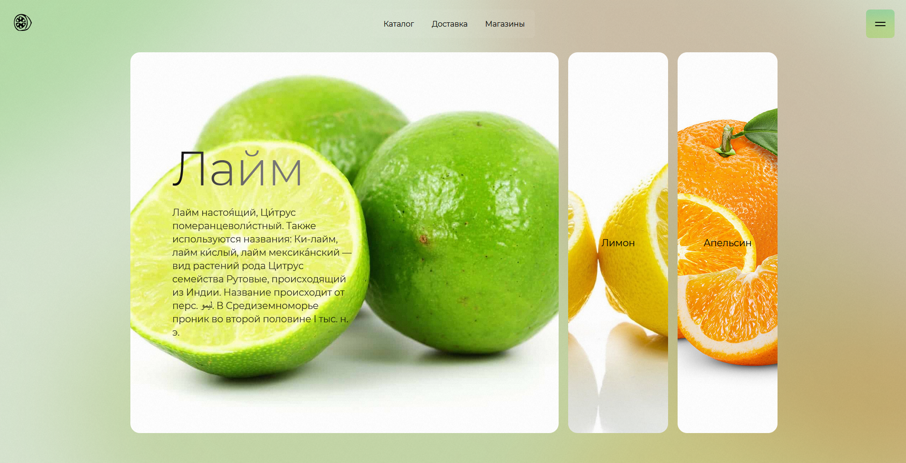
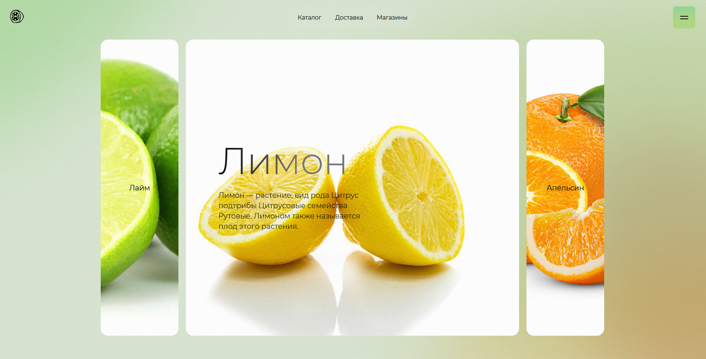
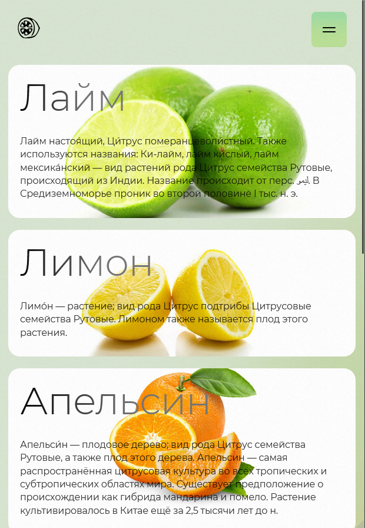
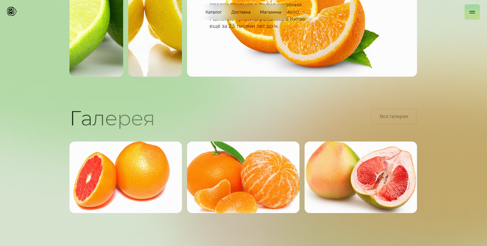
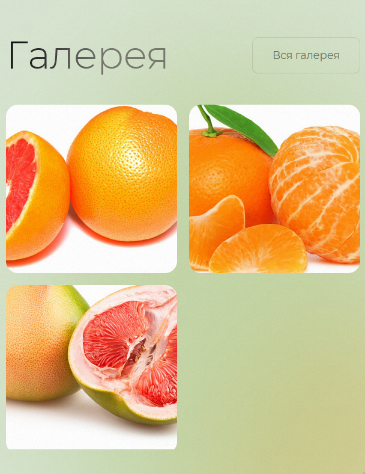
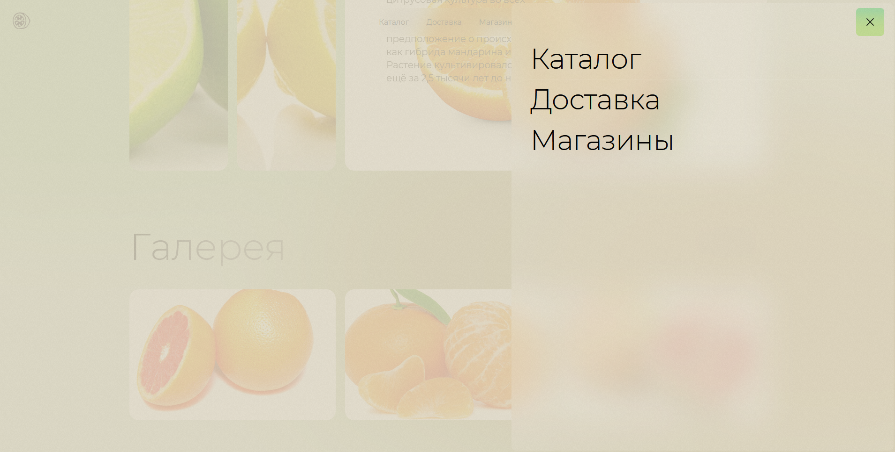
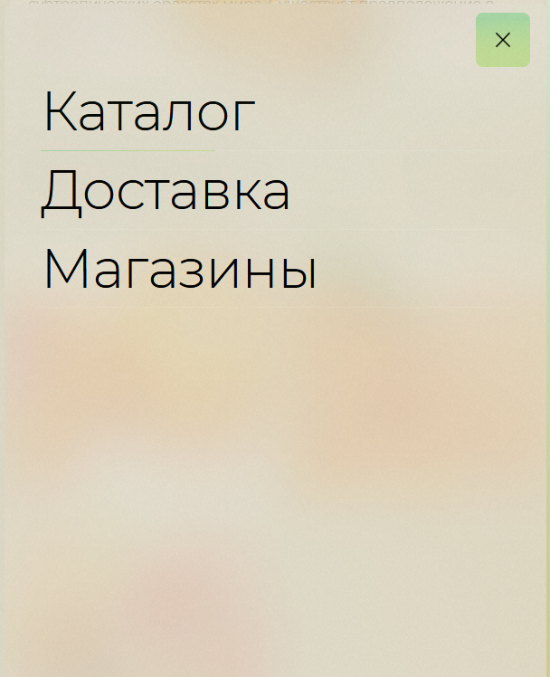

# https://bubenture.github.io/citrusLayout

 

    
    

### Верстка с акцентом на визуальные эффекты, плавную анимацию и интерактивность.

  
  
  
  
  
  
  

#### Используемые технологии
-	HTML5 — семантическая разметка.
-	CSS3 — кастомные переменные, анимации, адаптивность, эффекты градиентов и блюра.
-	JavaScript (ES6+) — интерактивность, анимации, обработка событий.
-	GSAP — библиотека для анимаций и скролл-эффектов (GSAP, ScrollTrigger).
-	Lenis — плавный скролл (Lenis).

#### Основные веб-элементы
-	Градиентный фон (.gradient-bg, .gradients-container, .g1, .g2, .g3, .interactive) — динамические цветовые пятна и интерактивный градиент, реагирующий на движение мыши.
-	Шапка сайта (.header-top, .top-line, .logo, .top-mnu) — фиксированная, с логотипом и навигацией.
-	Бургер-меню (.mnu-button__menu, .main-menu, .main-menu-background) — адаптивное выпадающее меню с анимацией.
-	Аккордеон (.accordion, .accordion__col, .accordion__bg, .accordion__content) — интерактивные секции с параллакс-эффектом и раскрывающимся контентом.
-	Галерея (.gallery, .gallery__wrapper, .gallery__item) — сетка изображений с параллакс-эффектом.
-	Кнопки (.btn-secondary) — стилизованные кнопки с градиентом и анимацией при наведении.

#### Особенности
-	Параллакс-эффекты на изображениях при скролле.
-	Плавные анимации появления и взаимодействия.
-	Адаптивная верстка для разных устройств.
-	Использование кастомных шрифтов (Montserrat).
